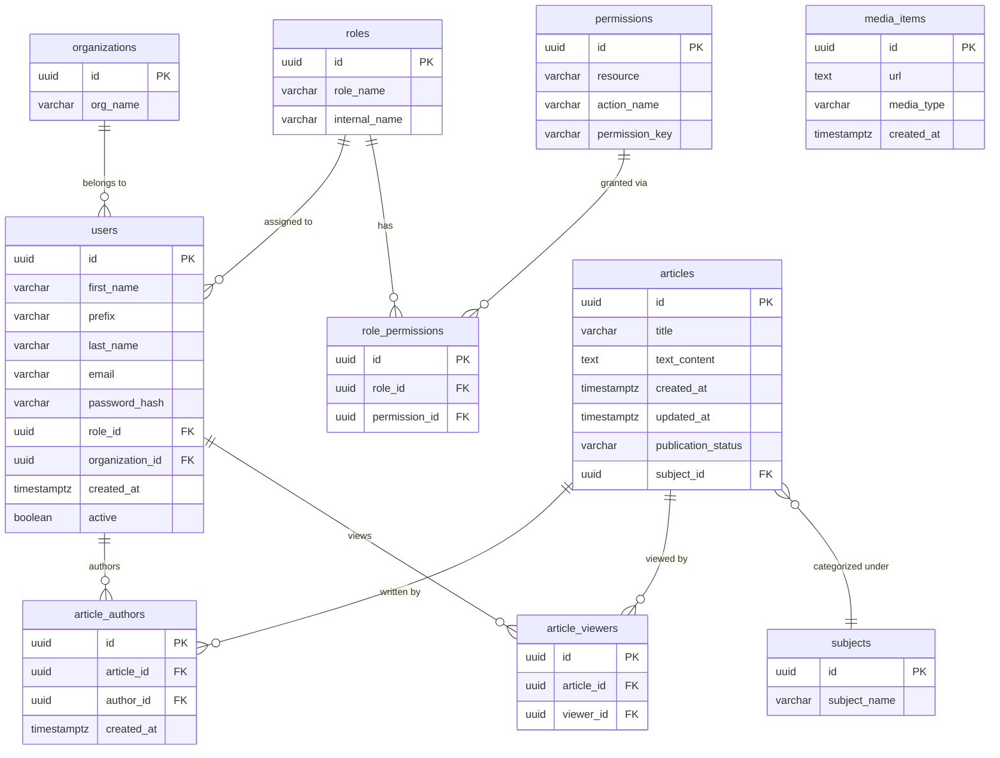

# PII Field Classification - PostgreSQL

This document identifies all tables and columns stored in PostgreSQL, classifies them by PII level, and documents GDPR compliance requirements.

## Related Documents
- [pii-classification-neo4j.md](pii-classification-neo4j.md) - Neo4j classification document for comment data and the `:User` projection.
- [pii-classification-redis.md](pii-classification-redis.md) - Redis classification document for cached, non-authoritative data.

## Classification Levels

| Level          | Description                                                                                                                                                 |
|----------------|-------------------------------------------------------------------------------------------------------------------------------------------------------------|
| **public**     | No PII. Safe to expose broadly.                                                                                                                             |
| **PII**        | Could be linked to a real person.                                                                                                                           |
| **PII_strict** | Highly sensitive. Contact channels, credentials, or data that could enable targeted abuse (scams, phising, credential attacks). Must be tightly controlled. |

---

## Database Schema Overview

`media_items` has no relationships to the other tables in PostgreSQL so it'll appear as an isolated entity, which is accurate — it's only referenced from Neo4j.

---

## Table: `users`

| Column            | Type        | PII Level  | Reason                                                                                                                                                                                                           |
|-------------------|-------------|------------|------------------------------------------------------------------------------------------------------------------------------------------------------------------------------------------------------------------|
| `id`              | UUID        | public     | Non-identifying surrogate key                                                                                                                                                                                    |
| `first_name`      | VARCHAR     | PII        | Identifies a real person                                                                                                                                                                                         |
| `prefix`          | VARCHAR     | PII        | Part of a person's name                                                                                                                                                                                          |
| `last_name`       | VARCHAR     | PII        | Identifies a real person                                                                                                                                                                                         |
| `email`           | VARCHAR     | PII_strict | Direct contact channel; enables phishing and scams if exposed                                                                                                                                                    |
| `password_hash`   | VARCHAR     | PII_strict | Authentication credential; resistant to offline cracking due to salting and cost factor, but exposure still enables targeted cracking attempts against weak passwords and signals which hash algorithm is in use |
| `role_id`         | UUID        | PII        | Describes an attribute of a specific person; personal data under GDPR Art. 4(1)                                                                                                                                  |
| `organization_id` | UUID        | PII        | Describes an attribute of a specific person; personal data under GDPR Art. 4(1)                                                                                                                                  |
| `created_at`      | TIMESTAMPTZ | PII        | Account creation timestamp relating to a specific person                                                                                                                                                         |
| `active`          | BOOLEAN     | PII        | Account status relating to a specific person                                                                                                                                                                     |

---

## Table: `organizations`

| Column     | Type    | PII Level | Reason                               |
|------------|---------|-----------|--------------------------------------|
| `id`       | UUID    | public    | Surrogate key                        |
| `org_name` | VARCHAR | public    | Organization name; not personal data |

---

## Table: `roles`

| Column          | Type    | PII Level | Reason                         |
|-----------------|---------|-----------|--------------------------------|
| `id`            | UUID    | public    | Surrogate key                  |
| `role_name`     | VARCHAR | public    | Display name for a role        |
| `internal_name` | VARCHAR | public    | Internal identifier for a role |

---

## Table: `permissions`

| Column           | Type    | PII Level | Reason                       |
|------------------|---------|-----------|------------------------------|
| `id`             | UUID    | public    | Surrogate key                |
| `resource`       | VARCHAR | public    | System resource name         |
| `action_name`    | VARCHAR | public    | Action label                 |
| `permission_key` | VARCHAR | public    | Unique permission identifier |

---

## Table: `role_permissions`

| Column          | Type | PII Level | Reason            |
|-----------------|------|-----------|-------------------|
| `id`            | UUID | public    | Surrogate key     |
| `role_id`       | UUID | public    | FK to roles       |
| `permission_id` | UUID | public    | FK to permissions |

---

## Table: `articles`

| Column               | Type        | PII Level | Reason               |
|----------------------|-------------|-----------|----------------------|
| `id`                 | UUID        | public    | Surrogate key        |
| `title`              | VARCHAR     | public    | Editorial content    |
| `text_content`       | TEXT        | public    | Editorial content    |
| `created_at`         | TIMESTAMPTZ | public    | Operational metadata |
| `updated_at`         | TIMESTAMPTZ | public    | Operational metadata |
| `publication_status` | VARCHAR     | public    | Editorial status     |
| `subject_id`         | UUID        | public    | FK to subjects       |

---

## Table: `article_authors`

| Column       | Type        | PII Level | Reason                                                                           |
|--------------|-------------|-----------|----------------------------------------------------------------------------------|
| `id`         | UUID        | public    | Surrogate key                                                                    |
| `article_id` | UUID        | public    | FK to articles                                                                   |
| `author_id`  | UUID        | public    | FK to `users.id` — UUID alone is not PII, but joins to `users` expose PII fields |
| `created_at` | TIMESTAMPTZ | public    | Operational metadata                                                             |

> **Note:** Joining `article_authors` with `users` exposes PII. Access to this join should follow `users` PII rules.

---

## Table: `article_viewers`

| Column       | Type | PII Level | Reason                                                                                                                      |
|--------------|------|-----------|-----------------------------------------------------------------------------------------------------------------------------|
| `article_id` | UUID | public    | FK to articles; not personal data in isolation                                                                              |
| `viewer_id`  | UUID | PII       | Behavioral tracking data — records which person read which article; personal data under GDPR with legitimate interest basis |

> **Note:** `viewer_id` links a user to specific articles they have read. Data subjects have the right to object to this processing (Art. 21) and the right to erasure (Art. 17).

---

## Table: `media_items`

| Column       | Type        | PII Level | Reason                         |
|--------------|-------------|-----------|--------------------------------|
| `id`         | UUID        | public    | Surrogate key                  |
| `url`        | TEXT        | public    | Storage URL; not personal data |
| `media_type` | VARCHAR     | public    | Enum-style type label          |
| `created_at` | TIMESTAMPTZ | public    | Operational metadata           |

---

## Table: `subjects`

| Column         | Type    | PII Level | Reason                   |
|----------------|---------|-----------|--------------------------|
| `id`           | UUID    | public    | Surrogate key            |
| `subject_name` | VARCHAR | public    | Editorial category label |

---

## Summary

| PII Level      | Table             | Fields                                                                                    |
|----------------|-------------------|-------------------------------------------------------------------------------------------|
| **PII_strict** | `users`           | `email`, `password_hash`                                                                  |
| **PII**        | `users`           | `first_name`, `prefix`, `last_name`, `role_id`, `organization_id`, `created_at`, `active` |
| **PII**        | `article_viewers` | `viewer_id`                                                                               |
| **public**     | all other tables  | all other fields                                                                          |

Tables with personal data: `users` (identity, credentials, and account attributes) and `article_viewers` (behavioral tracking). All other tables store editorial, relational, or system data with no direct link to an identifiable person.

---

## GDPR Compliance Reference

### Lawful Basis for Processing

| Data Category       | Fields                                               | Lawful Basis for Processing        | Notes                                                |
|---------------------|------------------------------------------------------|------------------------------------|------------------------------------------------------|
| Account identity    | `first_name`, `prefix`, `last_name`                  | Contract (Art. 6(1)(b))            | Necessary to provide the service to the user.        |
| Account credentials | `email`, `password_hash`                             | Contract (Art. 6(1)(b))            | Necessary for authentication.                        |
| Account metadata    | `role_id`, `organization_id`, `active`, `created_at` | Contract (Art. 6(1)(b))            | Necessary for access control and account management. |
| View tracking       | `article_viewers.viewer_id`                          | Legitimate Interest (Art. 6(1)(f)) | Analytics; could function anonymously.               |

### Retention Periods

> These are recommended periods. Formal retention periods should be documented and adopted in a separate data retention policy.

| Data Category                        | Recommended Retention Period                           | Notes                                                                                                                                                                                                                                                                    |
|--------------------------------------|--------------------------------------------------------|--------------------------------------------------------------------------------------------------------------------------------------------------------------------------------------------------------------------------------------------------------------------------|
| User personal data (`users`)         | Duration of account + 30 days or 5 years of inactivity | Retain for as long as the account is active. After deletion, retain for a short period to allow for cancellation of accidental deletions/changing minds, then delete permanently. If inactive for extended time, let user know through email and give 30 days to log in. |
| View tracking (`article_viewers`)    | 1 year                                                 | Retain for analytics purposes, but anonymize after 1 year to reduce risk.                                                                                                                                                                                                |
| Non-personal data (all other tables) | As needed, review periodically                         | Retain as long as operationally necessary. Review periodically to minimize data retention.                                                                                                                                                                               |

### Data Subject Rights

| Right                   | Applies to                                                     | Notes                                                                                                                                    |
|-------------------------|----------------------------------------------------------------|------------------------------------------------------------------------------------------------------------------------------------------|
| Access (Art. 15)        | `users` PII & PII_strict fields, `article_viewers`             | Must be able to export all data held about the user, including view history.                                                             |
| Rectification (Art. 16) | `users.first_name`, `prefix`, `last_name`                      | User must be able to correct their personal data. Emails are admin-managed and can only be changed with administrative support.          |
| Erasure (Art. 17)       | All personal data fields in `users`, `article_viewers` records | Account deletion must wipe PII/PII_strict fields; references (UUIDs) may be retained for referential integrity but should be anonymized. |
| Restriction (Art. 18)   | All personal data fields in `users`                            | Must be able to freeze processing of personal data without deleting it.                                                                  |
| Portability (Art. 20)   | `users` PII & PII_strict fields                                | Contract basis (Art. 6(1)(b)) and automated processing. Export in machine-readable format (e.g. JSON).                                   |
| Object (Art. 21)        | `article_viewers.viewer_id`                                    | Legitimate interest basis (Art. 6(1)(f)). Honor objections unless there are compelling legitimate grounds to continue processing.        |

> **Erasure notice**: When a user exercises their right to erasure, PII and PII_strict fields should be pseudonymised instead of being fully deleted. This should be done to preserve referential integrity (e.g. `article_authors.author_id` still references the user row). The `users.id` UUID is retained as a tombstone.
>
> **Important**: Pseudonymized data is still personal data under GDPR (Recital 26) if re-identification is possible. The pseudonymization approach must be formally documented and must ensure that the mapping back to the original identity is destroyed. For example, name fields could be replaced with a static placeholder like `[deleted]`, and the email could be replaced with an irreversible hash or `[deleted]`. Simply nulling fields may not satisfy erasure if the surrounding context still allows re-identification.
>
> The chosen pseudonymization approach should be reviewed before implementation. As this decision has legal implications, it should be made in consultation with a Data Protection Officer or legal counsel.

---

## Critical: `article_viewers` Has No Timestamp — Rolling Retention Cannot Be Enforced
The retention table specifies a 12-month rolling retention period for `article_viewers`. However, the table has no `viewed_at` or `created_at` column — only `id`, `article_id`, and `viewer_id`. There is no way to determine when a view occurred, so old records cannot be identified or purged.

To enforce the stated retention period, a `viewed_at TIMESTAMPTZ NOT NULL DEFAULT NOW()` column must be added to `article_viewers`.

---

## Critical: `users` Missing Columns to Support Erasure and Restriction
To support the right to erasure (Art. 17) and restriction of processing (Art. 18), the `users` table must have a way to pseudonymize or flag records as deleted/restricted without breaking referential integrity.
Currently, there is no tracking of deletion or restriction status, and no way to pseudonymize fields while retaining the row for referential integrity.

To comply, the following columns should be added to `users`:
- `is_deleted BOOLEAN NOT NULL DEFAULT FALSE`: Flag to indicate the account is deleted. When true, PII fields should be ignored or masked in application logic.
- `is_restricted BOOLEAN NOT NULL DEFAULT FALSE`: Flag to indicate processing is restricted. When true, processing of personal data should be frozen in application logic.
- `deleted_at TIMESTAMPTZ`: Timestamp of when the account was marked as deleted, for audit purposes.
- `last_active_at TIMESTAMPTZ`: Timestamp of last activity, to support inactivity-based retention.

Furthermore, a pseudonymization strategy must be defined for erasure and implemented in the application logic.

> The schema changes described here are a prerequisite for the erasure strategy outlined in the next critical note. Adding `is_deleted` and `is_restricted` flags without also fixing `deleteById` would leave the flags unused. Fixing `deleteById` without the schema changes leaves no way to track deletion and restriction status.

---

## Critical: `deleteById` Hard-Deletes the User Row — Erasure Strategy Is Not Implemented
> This note assumes the critical schema changes from the previous note have been implemented to support erasure and restriction. If those schema changes are not implemented, the issues described here are even more severe, as there is no way to pseudonymize or track deletion at all.

The erasure note above recommends pseudonymising PII fields and retaining the `users.id` UUID as a tombstone to preserve referential integrity. The actual implementation does the opposite: `deleteById` issues `DELETE FROM users WHERE id = :id`, which hard-deletes the row.

Because `article_authors.author_id` is defined with `ON DELETE CASCADE`, this also silently deletes all authorship records for that user's articles — destroying attribution history that may be needed for editorial or legal reasons.

To align with the documented erasure strategy:
- Replace the hard delete with a pseudonymisation step that nulls or replaces PII and PII_strict fields in-place.
- Evaluate whether cascading deletion of `article_authors` records is acceptable, or whether authorship should be preserved under a tombstone identity.

> Any change to the PostgreSQL erasure approach must be coordinated with the Neo4j erasure behavior. Currently `deleteById` also calls `Neo4jUserRepository.deleteById()`, which hard-deletes the `:User` node. If PostgreSQL moves to a pseudonymisation tombstone, a living `:User` node in Neo4j with name properties would be inconsistent — the Neo4j erasure strategy must be updated in parallel. See [pii-classification-neo4j.md](pii-classification-neo4j.md).
