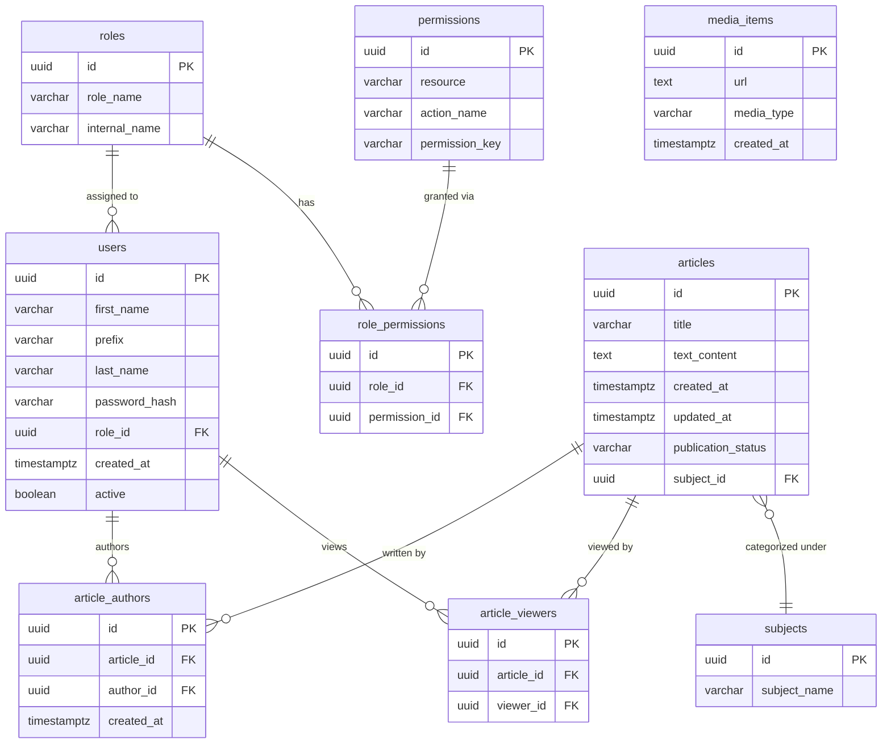

# PII Classificaties voor PostgreSQL

Dit document identificeert alle eigenschappen en relaties die in PostgreSQL worden opgeslagen.
De gegevens zijn geclassificeerd op basis van PII-niveau.
De GDPR-compliancevereisten voor elke eigenschap en relatie worden ook gedocumenteerd.

## Gerelateerde documenten
- [PII Classificaties voor Redis](pii-classification-redis.md)
- [PII Classificaties voor Neo4j](pii-classification-neo4j.md)
- [Database RBAC voor PostgreSQL](db-rbac-postgresql.md)

## Classificatieniveaus

| Niveau         | Beschrijving                                                                                                                         |
|----------------|--------------------------------------------------------------------------------------------------------------------------------------|
| **public**     | Geen PII. Veilig om bloot te stellen aan andere gebruikers.                                                                          |
| **PII**        | Kan direct of indirect gebruikt worden om een persoon te identificeren en beschrijven                                                |
| **PII_strict** | Zeer gevoelig. Contactkanalen, inloggegevens of gegevens die gerichte misbruik (scams, phishing, credential attacks) mogelijk maken. |

---

## Database Schema

> `media_items` heeft geen relaties met andere tabellen in PostgreSQL waardoor het als losstaande tabel wordt weergegeven.
> Deze tabel wordt naar gerefereerd in Neo4j voor het opslaan van media-URL's.

---

## Tabelclassificaties

### `users`
| Kolom             | Type        | PII Niveau | Reden                                                                                                                                                                                                                              |
|-------------------|-------------|------------|------------------------------------------------------------------------------------------------------------------------------------------------------------------------------------------------------------------------------------|
| `id`              | UUID        | public     | Unieke identifier zonder directe link naar een persoon                                                                                                                                                                             |
| `first_name`      | VARCHAR     | PII        | Identificeert direct een persoon                                                                                                                                                                                                   |
| `prefix`          | VARCHAR     | PII        | Identificeert direct een persoon                                                                                                                                                                                                   |
| `last_name`       | VARCHAR     | PII        | Identificeert direct een persoon                                                                                                                                                                                                   |
| `password_hash`   | VARCHAR     | PII_strict | Authenticatiegegevens; bestand tegen offline aanvallen door de salting en kosten van ontsleuteling, maar exposure zorgt nog steeds voor crack-aanvallen op zwakke wachtwoorden en zou signaleren welk hash algoritme in gebruik is |
| `role_id`         | UUID        | PII        | Verwijst naar een attribuut van een persoon                                                                                                                                                                                        |
| `created_at`      | TIMESTAMPTZ | PII        | Timestamp van een specifieke actie van een persoon                                                                                                                                                                                 |
| `active`          | BOOLEAN     | PII        | Status van een persoon binnen het systeem                                                                                                                                                                                          |

---

### `roles`

| Kolom           | Type    | PII Niveau | Reden                                                           |
|-----------------|---------|------------|-----------------------------------------------------------------|
| `id`            | UUID    | public     | Unieke identifier zonder directe link naar een persoon          |
| `role_name`     | VARCHAR | public     | Naam van een rol, niet direct gekoppeld aan een persoon         |
| `internal_name` | VARCHAR | public     | Interne naam van een rol, niet direct gekoppeld aan een persoon |

---

### `permissions`

| Kolom            | Type    | PII Niveau | Reden                                                                   |
|------------------|---------|------------|-------------------------------------------------------------------------|
| `id`             | UUID    | public     | Unieke identifier zonder directe link naar een persoon                  |
| `resource`       | VARCHAR | public     | Systeemresource waarvoor de permissie geldt                             |
| `action_name`    | VARCHAR | public     | Actie waarvoor de permissie geldt                                       |
| `permission_key` | VARCHAR | public     | Unieke sleutel voor de permissie, niet direct gekoppeld aan een persoon |

---

### `role_permissions`

| Kolom            | Type    | PII Niveau | Reden                                                              |
|------------------|---------|------------|--------------------------------------------------------------------|
| `id`             | UUID    | public     | Unieke identifier zonder directe link naar een persoon             |
| `role_id`        | UUID    | public     | Verwijst naar een rol, niet direct gekoppeld aan een persoon       |
| `permission_id`  | UUID    | public     | Verwijst naar een permissie, niet direct gekoppeld aan een persoon |

---

### `articles`

| Kolom                | Type        | PII Niveau | Reden                                                  |
|----------------------|-------------|------------|--------------------------------------------------------|
| `id`                 | UUID        | public     | Unieke identifier zonder directe link naar een persoon |
| `title`              | VARCHAR     | public     | Editoriale data                                        |
| `text_content`       | TEXT        | public     | Editoriale data                                        |
| `created_at`         | TIMESTAMPTZ | PII        | Operationele metadata                                  |
| `updated_at`         | TIMESTAMPTZ | PII        | Operationele metadata                                  |
| `publication_status` | VARCHAR     | public     | Editoriale status                                      |
| `subject_id`         | UUID        | public     | Verwijst naar een onderwerp                            |

---

### `article_authors`

| Kolom        | Type        | PII Niveau | Reden                                                                              |
|--------------|-------------|------------|------------------------------------------------------------------------------------|
| `id`         | UUID        | public     | Unieke identifier zonder directe link naar een persoon                             |
| `article_id` | UUID        | public     | Verwijst naar een artikel                                                          |
| `author_id`  | UUID        | PII        | Verwijst naar een gebruiker, wat een persoon identificeert                         |
| `created_at` | TIMESTAMPTZ | PII        | Operationele metadata, maar ook gekoppeld aan een specifieke actie van een persoon |

---

### `article_viewers`

| Kolom        | Type | PII Niveau | Reden                                                                                                                                                     |
|--------------|------|------------|-----------------------------------------------------------------------------------------------------------------------------------------------------------|
| `article_id` | UUID | public     | Verwijst naar een artikel                                                                                                                                 |
| `viewer_id`  | UUID | PII        | Gedragsgegevens van een persoon. Valt onder legitieme belangen binnen GDPR. Mogelijk te anonimiseren of pseudonimiseren als dit nodig is voor compliance. |

---

### `media_items`

| Kolom        | Type        | PII Niveau | Reden                                                                                             |
|--------------|-------------|------------|---------------------------------------------------------------------------------------------------|
| `id`         | UUID        | public     | Unieke identifier zonder directe link naar een persoon                                            |
| `url`        | TEXT        | public     | Link waar media-item opgeslagen is op de server, niet waar het opgeslagen was bij de gebruiker.   |
| `media_type` | VARCHAR     | public     | Enum-string label voor het media-type (bijv. "image/jpeg"), niet direct gekoppeld aan een persoon |
| `created_at` | TIMESTAMPTZ | public     | Operationele metadata                                                                             |

---

### `subjects`

| Kolom          | Type    | PII Niveau | Reden                                                  |
|----------------|---------|------------|--------------------------------------------------------|
| `id`           | UUID    | public     | Unieke identifier zonder directe link naar een persoon |
| `subject_name` | VARCHAR | public     | Naam van een onderwerp                                 |

---

## Samenvatting

| PII Niveau     | Tabel                 | Velden                                                                 |
|----------------|-----------------------|------------------------------------------------------------------------|
| **PII_strict** | `users`               | `password_hash`                                                        |
| **PII**        | `users`               | `first_name`, `prefix`, `last_name`, `role_id`, `created_at`, `active` |
| **PII**        | `article_viewers`     | `viewer_id`                                                            |
| **public**     | Alle overige tabellen | Alle overige velden                                                    |

Tabellen met persoonlijke data:
- `users` (identiteitsgegevens, credentislals en accountattributen)
- `article_viewers` (gedragsgegevens)

Elke andere tabel bevat enkel editoriale, relationele of operationele metadata zonder directe link naar een persoon.

---

## GDPR Compliance Vereisten

### Rechtmatigheid (Art. 6)
| Data Categorie       | Velden                              | Rechtmatige Basis              | Toelichting                                                                                  |
|----------------------|-------------------------------------|--------------------------------|----------------------------------------------------------------------------------------------|
| Account identiteit   | `first_name`, `prefix`, `last_name` | Contract (Art. 6(1)(b))        | Noodzakelijk voor accountbeheer                                                              |
| Account credentialen | `password_hash`                     | Contract (Art. 6(1)(b))        | Noodzakelijk voor het uitvoeren van een contract met de gebruiker (authenticatie)            |
| Account metadata     | `role_id`, `active`, `created_at`   | Contract (Art. 6(1)(b))        | Noodzakelijk voor accountbeheer                                                              |
| Gedragsgegevens      | `article_viewers.viewer_id`         | Legitiem belang (Art. 6(1)(f)) | Analyse; kan mogelijk worden geanonimiseerd of gepseudonimiseerd om compliance te verbeteren |

### Retentie

> Dit zijn initiële aanbevelingen op basis van de huidige gegevens en gebruikspatronen.
> Deze aanbevelingen zijn nog niet definitief, verwerkt in beleid, of gecommuniceerd in een officiële capaciteit.
> Formele retentieperiodes moeten worden vastgesteld in overleg met juridische en compliance teams, en duidelijk worden gecommuniceerd aan gebruikers.

| Data Categorie                            | Aanbevolen Retentieperiode       | Notities                                                                                                                                                                                             |
|-------------------------------------------|----------------------------------|------------------------------------------------------------------------------------------------------------------------------------------------------------------------------------------------------|
| Persoonlijke data (`users`)               | Duur van het account + 30 dagen  | Retentie van accountgegevens zolang het account actief is, plus een korte periode na deactivering voor mogelijke heractivering. Na deze periode moeten gegevens worden verwijderd of geanonimiseerd. |
| Gedragsgegevens (`article_viewers`)       | 1 jaar                           | Behoud voor analyse en productverbetering, maar anonimiseer of pseudonimiseer na 1 jaar om privacyrisico's te verminderen.                                                                           |
| Niet-persoonlijke data (overige tabellen) | Zolang nodig, regelmatig herzien | Retentie op basis van operationeel gebruik. Herzien regelmatig om data retentie te minimaliseren waar mogelijk.                                                                                      |

### Rechten van betrokkenen

| Recht                           | Betrekking tot                                             | Notities                                                                                                                                                                                                                |
|---------------------------------|------------------------------------------------------------|-------------------------------------------------------------------------------------------------------------------------------------------------------------------------------------------------------------------------|
| Toegang (Art. 15)               | `users` PII en PII_strict velden, `article_viewers`        | Alle gegevens moeten geexporteerd kunnen worden van de gebruiker.                                                                                                                                                       |
| Rectificatie (Art. 16)          | `users` (`first_name`, `prefix`. `last_name`)              | Persoonlijke gegevens moeten bijgewerkt kunnen worden.                                                                                                                                                                  |
| Verwijdering (Art. 17)          | Alle persoonlijke gegevens in `users` en `article_viewers` | Verwijderen van een account moet de gegevens van PII en PII_strict velden verwijderen. Referenties (UUIDs) kunnen voor referentiële doeleinden behouden worden, maar moeten worden geanonimiseerd of gepseudonimiseerd. |
| Restrictie (Art. 18)            | Alle persoonlijke gegevens in `users`                      | Er moet een mechanisme zijn om de verwerking van persoonlijke gegevens niet te processen zonder deze te verwijderen.                                                                                                    |
| Dataoverdraagbaarheid (Art. 20) | `users` PII & PII_strict velden                            | Gegevens moeten worden geëxporteerd in een gestructureerd, machine-leesbaar formaat (zoals JSON) dat gemakkelijk kan worden overgedragen aan een andere controller, indien verzocht door de gebruiker.                  |
| Bezwaar maken (Art. 21)         | `article_viewers.viewer_id`                                | Op basis van legitieme belangen moeten gebruikers de mogelijkheid hebben om bezwaar te maken tegen de verwerking van hun gedragsgegevens. Na bezwaar moeten deze gegevens geanonimiseerd of gepseudonimiseerd worden.   |

> **Nog belangrijk**: Gepseudonomiseerde data wordt nog steeds als persoonlijke data gezien onder GDPR (Recital 26), zolang re-identificatie mogelijk is. 
> Pseudonomisatie moet formeel in beleid worden gedefinieerd, en de gebruikte methoden moeten het onmogelijk maken om een individu te identificeren na pseudonomisatie.
> Anonymisatie is de enige manier om data volledig uit de scope van GDPR te halen, maar dit kan de bruikbaarheid van data voor analyse verminderen. 
> De keuze tussen pseudonomisatie en anonymisatie moet zorgvuldig worden gemaakt op basis van de specifieke use case en compliance vereisten.

---

## Issues
### `article_viewers` biedt geen mechanisme om retentieperioden af te dwingen
In sectie [Retentie](#retentie) wordt aanbevolen om `article_viewers` een retentie van 1 jaar te geven, met anonimisering of pseudonimisering daarna.
Er is echter geen mogelijkheid om deze retentie af te dwingen binnen PostgreSQL zelf, aangezien er geen timestamp is die aangeeft wanneer een viewer een artikel heeft bekeken.
Zonder deze timestamp kunnen we niet automatisch bepalen wanneer een viewer-record ouder is dan 1 jaar en klaar is voor anonimisering of verwijdering.
Om dit op te lossen, zijn er twee mogelijke benaderingen:
- Voeg een `viewed_at` timestamp toe aan de `article_viewers` tabel.
  Dit zou het mogelijk maken om een periodieke batch job te implementeren die records ouder dan 1 jaar identificeert en anonimiseert of verwijdert.
- Een andere mogelijkheid is om de `viewer_id` bij insertie te pseudonimiseren door een gesalte hash te gebruiken van de UUID. Dit maakt directe identificatie onmogelijk, maar behoudt ook nog de mogelijkheid om unieke viewers te tellen voor analytische doeleinden.
  Deze mogelijkheid maakt het niet mogelijk een batch job te implementeren voor het verwijderen van individuele records, maar het elimineert wel de directe PII risico's zonder een timestamp toe te voegen.

---

### `users` heeft geen mechanisme om restrictie en verwijdering te ondersteunen
Om de rechten van betrokkenen te ondersteunen, moet de `users` tabel een mechanisme hebben om gebruikers te pseudonimiseren of te labelen als verwijderd/beperkt zonder de referentiële integriteit van de database te breken.
Momenteel kan een deactivatie van een account worden aangegeven met de `active` boolean, maar dit geeft niet de mogelijke extra context en verzorgt ook niet voor de acties die hiermee gepaard moeten gaan (zoals het anonimiseren van PII-velden).
Een mogelijke oplossing is om de volgende extra velden toe te voegen:
- `is_deleted BOOLEAN NOT NULL DEFAULT FALSE`: Een veld om aan te geven dat een account is verwijderd. Dit is een soft-delete mechanisme die ervoor zorgt dat de referentiële integriteit behouden blijft, terwijl het ook duidelijk aangeeft dat het account niet langer actief is.
- `is_restricted BOOLEAN NOT NULL DEFAULT FALSE`: Een veld om aan te geven dat de verwerking van dit account is beperkt. De verwerking van persoonlijke gegevens van dit account moet worden beperkt zonder deze volledig te verwijderen.
- `deleted_at TIMESTAMPTZ`: Een timestamp die aangeeft wanneer een account is verwijderd. Dit kan nuttig zijn voor auditdoeleinden en om te voldoen aan retentievereisten.

Hiernaast moet een pseudonimisatiestrategie worden gedefinieerd en geïmplementeerd voor het anonimiseren van PII-velden.

> De wijzigingen die hier worden voorgesteld zijn nodig voordat er een verwijderstrategie kan worden geïmplementeerd (zie de volgende issue).
> Als de velden `is_deleted` en `is_restricted` worden toegevoegd zonder de verwijderstrategie te implementeren zoals beschreven in de volgende issue, zouden deze velden ongebruikt blijven en zou er geen manier zijn om de verwijdering of restrictie status van een account bij te houden.

---

### `deleteById` verwijdert de hele rij in plaats van te pseudonimiseren
> Dit punt gaat ervan uit dat de schemawijzigingen hierboven zijn doorgevoerd. 
> Zolang deze wijzigingen niet zijn doorgevoerd, is er geen mogelijkheid om een account te pseudonimiseren of überhaupt verwijderingen bij te houden zonder de referentiële integriteit van de database te breken.

De huidige implementatie van `deleteById` in `UserRepository` verwijdert de hele rij van de gebruiker uit de database.
Dit is in directe strijd met de aanbevolen pseudonimisatiestrategie die hierboven is beschreven, en breekt referentiële integriteit of analytische mogelijkheden, afhankelijk van het plan per tabel.
Zo is `article_authors.author_id` gedefineerd met `ON DELETE CASCADE`.
Hierdoor wordt het auteurschap van alle artikelen die aan deze gebruiker zijn gekoppeld verwijderd wanneer de gebruiker wordt verwijderd.

In plaats van de rij volledig te verwijderen, zou `deleteById` moeten worden aangepast om de volgende acties uit te voeren:
- Vervang de hard-delete met een pseudonimisatiestap die de PII- en PII_strict-velden van de gebruiker vervangt door geanonimiseerde of gepseudonimiseerde waarden.
- Evalueer de impact van een `CASCADE` strategie op `article_authors` en overweeg om auteurschap op te vangen met een tombstone record of een generieke identiteit.

> Elke wijziging op de verwijderstrategie moet worden gecoördineerd met de Neo4j verwijderstrategie.
> Momenteel roept `deleteById` ook `Neo4jUserRepository.deleteById` aan, die een hard-delete uitvoert op de Neo4j `:User` node.
> Als PostgreSQL overstapt op een pseudonimisatiestrategie, moet de Neo4j laag ook worden aangepast om een vergelijkbare pseudonimisatiestrategie te implementeren in plaats van een hard-delete, om consistentie tussen de systemen te behouden.
